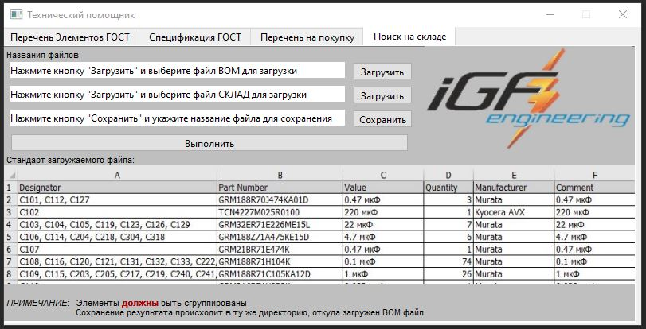

# Технический помощник
### Краткое описание

Приложение создано для автоматического:
- Создания перечня элементов по ГОСТ структуре;
- Создания спецификации элементов по ГОСТ структуре;
- Создания сортированного и сгруппированного списка элементов для закупки;
- Поиска элементов в файле склада.

***ВНИМАНИЕ!  Все загружаемые BOM (Bill_of_Materials) файлы должны чётко соответствовать, 
указанному шаблону. В противном случае будет происходить ошибка программы.***